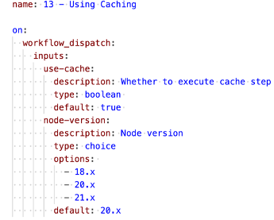

## Project Name: 13 - Using Caching
Project Name: 13 - Using Caching

Overview

This project demonstrates the use of caching in GitHub Actions to optimize CI/CD workflows for a React application. The workflow:
•	Calculates a unique cache key based on the package-lock.json file.
•	Conditionally downloads cached dependencies using the actions/cache action.
•	Installs dependencies only when the cache is not available.
•	Builds, tests, and lints the project in separate jobs to showcase modular workflow design.

