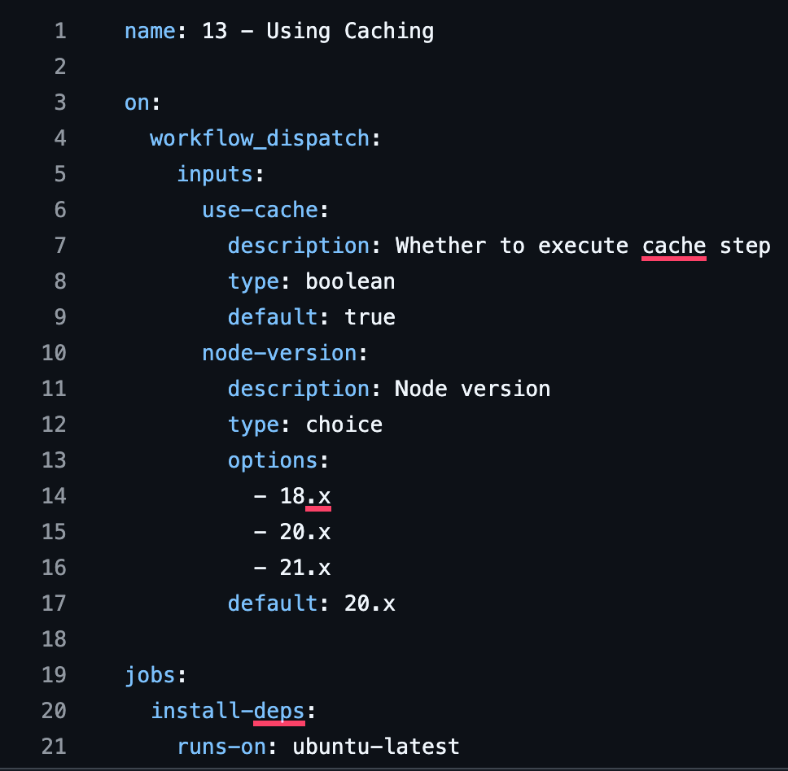
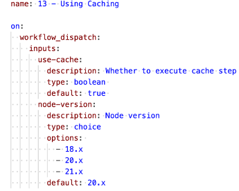
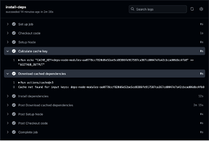
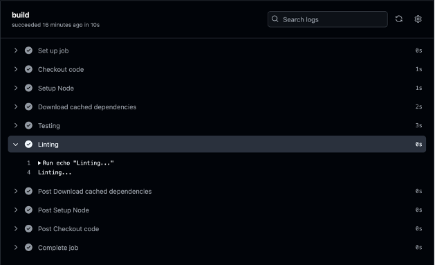
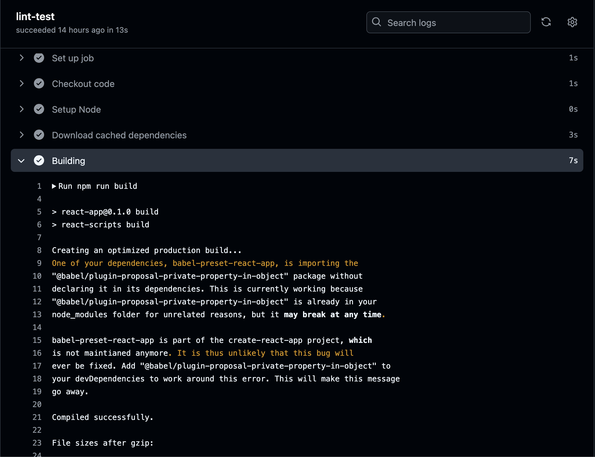
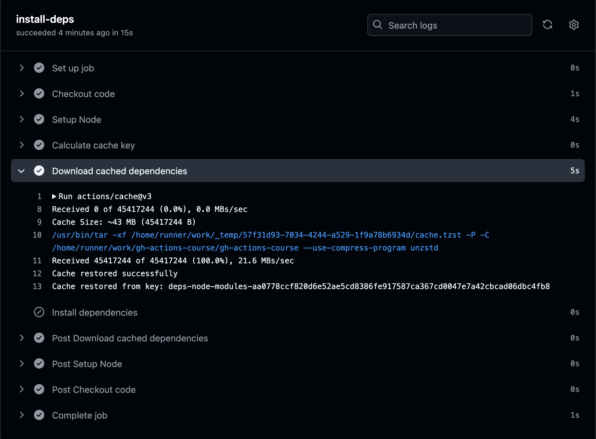
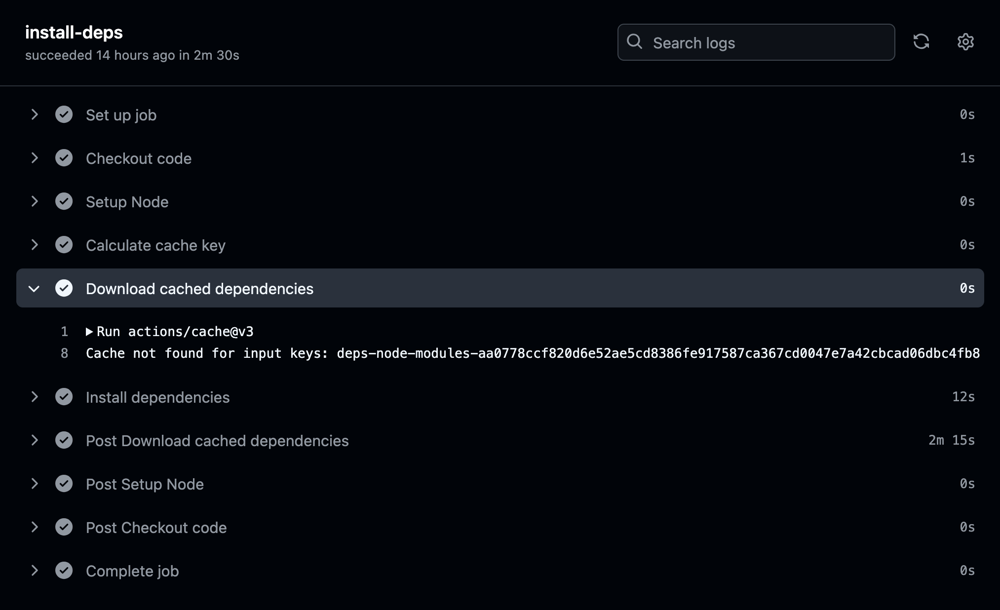
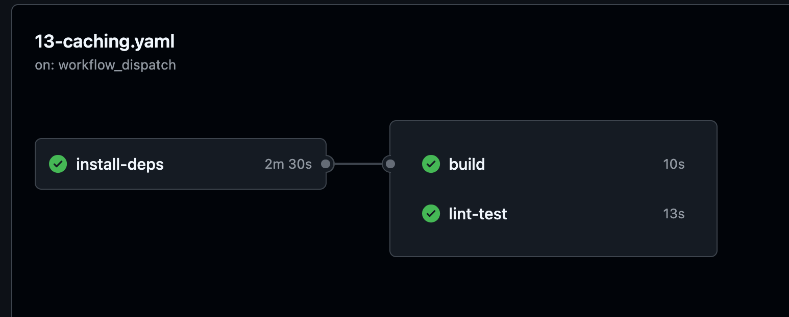

## Devop-CI/CD-Project Name: 13 - Using Caching

### Overview

This project demonstrates the use of caching in GitHub Actions to optimize CI/CD workflows for a React application. The workflow:
- Calculates a unique cache key based on the `package-lock.json` file.
- Conditionally downloads cached dependencies using the `actions/cache` action.
- Installs dependencies only when the cache is not available.
- Builds, tests, and lints the project in separate jobs to showcase modular workflow design.

### Screenshot: Caching Trigger Workflow

----------------------------------------------

<u>**Workflow Breakdown**</u>  

1. Trigger Events
o	The workflow starts using workflow_dispatch.
o	Takes user inputs (use-cache and node-version) for dynamic configuration.

----------------------------------------------

2.	**Install Dependencies Job (install-deps)**
Responsibilities:
o	Checks out the code.
o	Sets up Node.js with the user-selected version.
o	Calculates a cache key.
o	Downloads dependencies from the cache or installs them if the cache is unavailable.

**Cache Key Calculation**
The calculated cache key is clearly shown:
deps-node-modules-aa0778ccf....

Cache Usage: The log indicates a cache miss, as the cache was not found for the input keys.
"Cache not found for  input keys: deps-node-modules-aa0778ccf..."

------------------------------------------------
3.	**Build Job (build)**
Responsibilities:
o	Depends on the install-deps job.
o	Reuses the cached dependencies.
o	Builds the project and runs linting

This job handles compiling and preparing the application. It relies on the install-deps job to retrieve cached dependencies. Here are the steps:

1.Download Cached Dependencies: Uses the dependencies cached by the install-deps job.
2.Testing-Runs tests to check that the application is functioning correctly.
3.Linting-Checks the code for errors and ensures it follows the required formatting standards.

------------------------------------------------
4.	**Lint-Test Job (lint-test)**
Responsibilities:
o	Similar to build, depends on install-deps for caching.
o	Runs build, lint, and test commands.

 

This screenshot shows the "Building" step of the lint-test job. The following happens:

<u>**Command Execution**</u>
The npm run build command is executed, triggering the React app's build process using react-scripts.

<u>**Warning**</u>
A warning appears about a deprecated dependency babel-preset-react-app, which is importing another package incorrectly. While this warning doesn't stop the build, it suggests adding a specific package @babel/plugin-proposal-private-property-in-object to prevent future issues.

<u>**Build Success** </u>
The application compiles successfully, producing an optimized production build. It lists file sizes for the output files (e.g., JavaScript and CSS bundles).

-------------------------------------------------
**Expected Workflow Behavior**
1.	<u>Cache Hit</u>
o	Shows "Cache restored from..." message in the install-deps job.
o	Workflow execution time is reduced.

 

In this screenshot, the "Download cached dependencies" step of the install-deps job is being executed. Here’s what’s happening:

<u>**Cache Search**</u>
GitHub Actions looks for a previously stored cache using the  key deps-node-modules-aa0778ccf820d6e52ae5cd8386fe917587ca367cd0047e7a42cbcad06dbc4fb8.

<u>**Cache Found**</u>
The cache is successfully found, and it shows a message:
Cache restored successfully.

<u>**Cache Details**</u>

The cache file size is approximately 43 MB ( Cache Size: ~43 MB.)

The cache is downloaded and extracted to the appropriate directory (node_modules).
Result:
Since the cache was restored, the workflow doesn’t need to reinstall dependencies, saving time.

This means the cache system is working as intended, and the dependencies are being reused from the previous runs.

---------------------------------------------------------

2.	**Cache Miss**
o	Shows "Cache not found" message in the install-deps job.
o	Dependencies are freshly installed.

**<u>In the Cache Miss screenshot, here is what is happening</u>**

<u>Cache Search</u>
GitHub Actions is looking for a stored cache using the  key deps-node-modules-aa0778ccf820d6e52ae5cd8386fe917587ca367cd0047e7a42cbcad06dbc4fb8.

<u>Cache Not Found</u>
A message appears:
 Cache not found for input keys: deps-node-modules-aa0778ccf820d6e52ae5cd8386fe917587ca367cd0047e7a42cbcad06dbc4fb8.

This means there’s no existing cache available for this key.

Next Steps
Since the cache isn’t available, the workflow proceeds to install dependencies from scratch in the Install dependencies step. This takes more time than reusing a cached version.

This shows that the cache system didn’t have any stored data matching the provided key, so a fresh installation of dependencies is required.

---------------------------------------------------
**Results and Benefits**

•	Workflow execution time is optimized when caching is enabled.
•	Demonstrates the effective use of GitHub Actions caching for dependency management.

This screenshot shows the final summary of the workflow. All jobs  install-deps, build, and lint-test 

completed successfully. 

The install-deps  

job ran first, taking 15 seconds, followed by build (18 seconds) 
and  lint-test 

(15 seconds). The diagram shows the workflow ran smoothly, with each job marked as successful.
