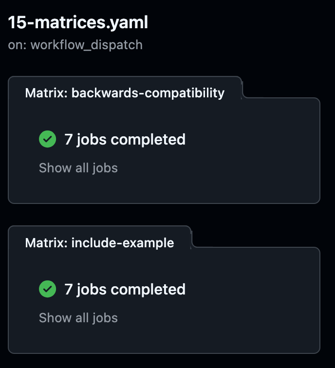

<u>**Project Name: 15 - Working with Matrices**</u>

------------------------------------------------------
**Overview**
This project is about using matrices in GitHub Actions to test different combinations of environments and configurations in a single workflow. A matrix lets you define variables like operating systems, Node.js versions, or other parameters, and GitHub Actions automatically creates a job for each possible combination.

<u>For example you can use matrices to</u>

Test your code on multiple Node.js versions (e.g., 16.x, 18.x, 20.x).
Run the tests on different operating systems (e.g., Ubuntu and Windows).
Matrices are a great way to automate repetitive tasks. Instead of creating separate workflows for each environment, GitHub Actions handles it all in one workflow, saving time and ensuring thorough testing.

<u>In this project two matrix-based jobs are used</u>

Backwards Compatibility Job: Tests Node.js across different operating systems and versions to ensure compatibility.
Include-Example Job: Demonstrates advanced use of matrices by combining variables like colors, shapes, sizes, and other custom parameters.

This setup allows for flexible, efficient, and comprehensive testing across various scenarios.

