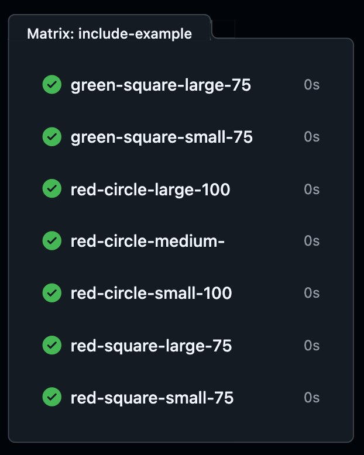

<u>**Devop-CI/CD-Project Name: 15 - Working with Matrices**</u>

------------------------------------------------------
**Overview**
This project is about using matrices in GitHub Actions to test different combinations of environments and configurations in a single workflow. A matrix lets you define variables like operating systems, Node.js versions, or other parameters, and GitHub Actions automatically creates a job for each possible combination.

<u>For example you can use matrices to</u>

Test your code on multiple Node.js versions (e.g., 16.x, 18.x, 20.x).
Run the tests on different operating systems (e.g., Ubuntu and Windows).
Matrices are a great way to automate repetitive tasks. Instead of creating separate workflows for each environment, GitHub Actions handles it all in one workflow, saving time and ensuring thorough testing.

-------------------------------------------------
<u>In this project two matrix-based jobs are used</u>

**Backwards Compatibility Job** 
Tests Node.js across different operating systems and versions to ensure compatibility.
**Include-Example Job** 
Demonstrates advanced use of matrices by combining variables like colors, shapes, sizes, and other custom parameters.

This setup allows for flexible, efficient, and comprehensive testing across various scenarios.

<image src="matrices-job-workflow.png" alt="matrix overview" width="180" height="auto"> 

--------------------------------------------------------
<!DOCTYPE html>
<html lang="en">
<head>
    <meta charset="UTF-8">
    <meta name="viewport" content="width=device-width, initial-scale=12.0">

</head>
<body>
    <h5>15 - Working with Matrices</h1>
    <pre>
<code class="menlo">
name: 15 - Working with Matrices

on:
  workflow_dispatch

jobs: 
  backwards-compatibility:
    name: key ${{ matrix.os }}-${{ matrix.node-version }}
    runs-on: ${{ matrix.os }}
    strategy:
      fail-fast: true
      matrix:
        node-version: [18.x, 20.x, 21.x]
        os: 
          - ubuntu-latest
          - windows-latest
        include:
          - os: ubuntu-latest
            node-version: 16.x
            tag: experimental
          - os: ubuntu-latest
            node-version: 21.x
            tag: experimental
    steps: 
      - name: Setup node
        uses: actions/setup-node@v3
        with:
          node-version: ${{ matrix.node-version }}
      - name: Perform some tests
        run: | 
          echo "Running test on OS ${{ matrix.os }} and NodeJS ${{ matrix.node-version }}"
      - name: Upload test results
        run: echo "Uploading test results"

  include-example:
    runs-on: ubuntu-latest
    name: ${{ matrix.colour }}-${{ matrix.shape }}-${{ matrix.size }}-${{ matrix.opacity }}
    strategy:
      matrix:
        colour: [red, green]
        shape: [circle, square]
        size: [small, large]
        include:
          - opacity: 50
          - colour: red
          - opacity: 75
          - shape: circle
            opacity: 100
          - colour: red
            shape: circle
            size: medium
        exclude:
          - colour: green
            shape: circle
    steps:
      - name: Dummy step
        run: |
          echo "Running test with colour=${{ matrix.colour }}, shape=${{ matrix.shape }}, size=${{ matrix.size }}"
</code>
    </pre>
</body>
</html>

-------------------------------

2. Include Example Job Responsibilities

**Matrix Strategy** 
Runs with custom combinations of colour, shape, size, and opacity.
**Include/Exclude Clauses**
Uses include to add unique configurations like opacity and special colour-shape-size combinations.
Uses exclude to avoid incompatible combinations like green-circle.
Steps:
Dummy Test: Logs the matrix values for each job.

**Matrix Overview**
This screenshot shows all the different combinations of color, shape, size, and opacity that were tested. It gives a clear idea of how many configurations were run and how the matrix strategy was applied.

**All Jobs Passed**
Every job has a green checkmark, meaning all the tests ran successfully without any errors.

**Clear Job Names**
The job names are created dynamically using the matrix values, like green-square-large-75 and red-circle-large-100, making it easy to identify and track specific configurations. 

--------------------------------------------------
**Job**

<image src="matrices generating values1.png" alt="matrix overview" width="350" height="auto"> 

**Job Name** The dynamically generated job name green-square-large-75 based on matrix variables (colour, shape, size, opacity).
**Steps Executed**
Dummy Step: Logs the values of matrix variables.
Dynamic Output: Confirms the matrix values (colour=green, shape=square, size=large).
This screenshot effectively demonstrates:

The dynamic nature of matrix workflows.
The output of specific job configurations.
A successful execution for a matrix combination.

--------------------------------------------------
**All Combinations Executed**
 

**Screenshot** 
Workflow summary showing all combinations of operating systems and Node.js versions successfully executed, including experimental configurations.

----------------------
The matrix includes multiple operating systems

<!DOCTYPE html>
<html lang="en">
<head>
    <meta charset="UTF-8">
    <meta name="viewport" content="width=device-width, initial-scale=1.0">
        }
    </style>
</head>
<body>
    

        ubuntu-latest, windows-latest and 
        Node.js versions (16.x, 18.x, 20.x, 21.x)
        Each combination is successfully executed, as shown by the green checkmarks.
    

</body>
</html>

**Workflow Summary**

It provides a concise overview of all the jobs and their respective execution times. 

**Experimental Configurations**

Includes combinations like ubuntu-latest-16.x, which is flagged as experimental in your workflow configuration.

